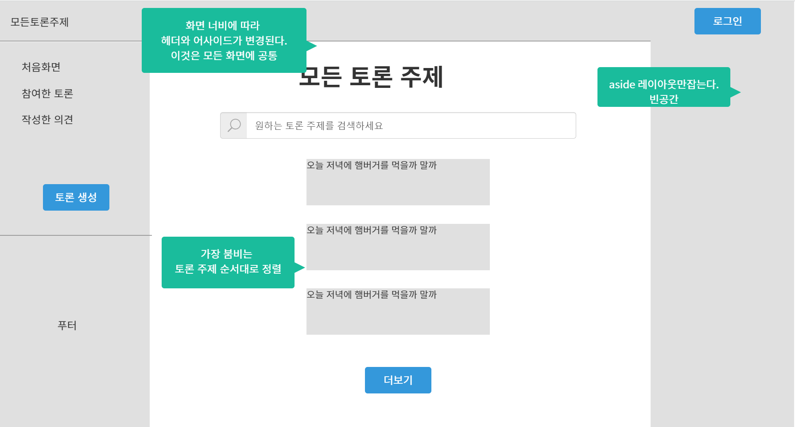
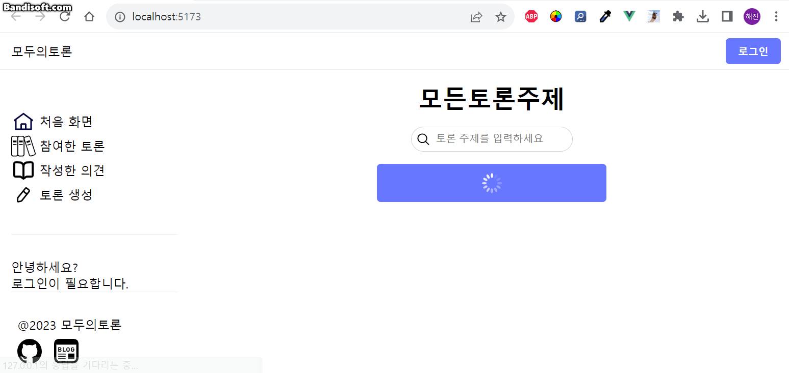
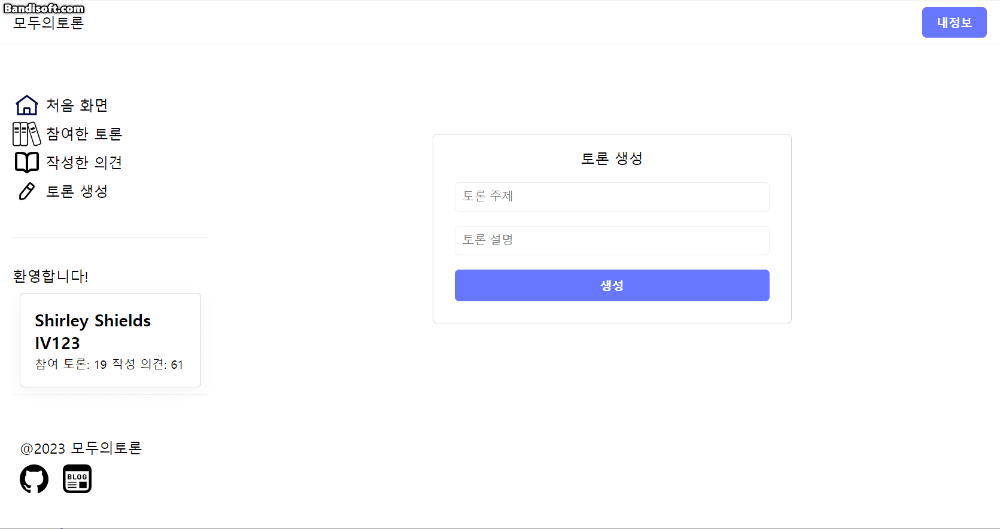
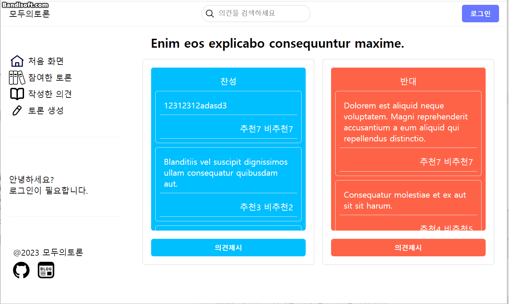
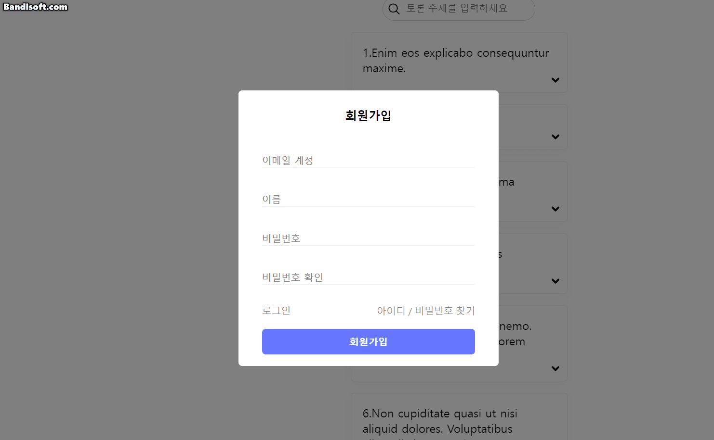
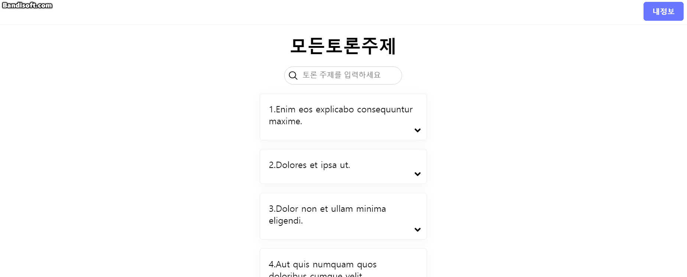
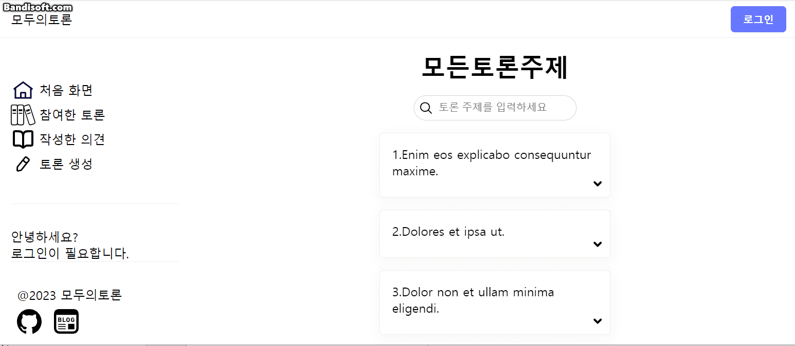

# 개요

모두의 토론의 프론트엔드 레포지토리이다.
[백엔드 바로가기](https://github.com/HaejinYang/every-discussion-backend)

# 기술 스택

typescript, Vue.js 3, pinia

# 목업

프로젝트 진행 전 구상을 위한 목업이다. 자세한 내용은 다음 [링크](https://ovenapp.io/view/vHYglcf3PXrqDKcqUOXYsBKKf7CJflvs/OvHxh)에서 확인 가능하다.


# 구현

## 구현 내용

### 1. 토론 주제 로딩 무한 스크롤



### 2. 디바운스를 활용한 검색



### 3. 반응형 레이아웃



### 4. 모달로 생성한 로그인 및 회원가입



### 5. 로그인한 유저 정보 관리



## 구현중 해결한 문제

### 문제 1. 틱톡과 같이 고정된 헤더와 어사이드를 유지하며 메인에 스크롤 적용

#### 상황

브라우저에서 본 틱톡은 헤더와 어사이드가 고정되어 있고, 메인이 유동적으로 변한다. 메인엔 스크롤이 적용되어 있으며, 메인에 스크롤링을 하더라도 헤더와 어사이드는 유지된다. 이를 구현하고 싶었다.

#### 해결

헤더와 어사이드를 고정하면서 브라우저의 세로 높이가 변하더라도 메인의 여백이 채워지도록 레이아웃에 flex를 사용하였다. 문제가 생긴 부분은 메인에 스크롤이 적용이 안되는 것이었다.
고정된 높이를 가져야 수직 스크롤이 생성되기 때문이다. flex item은 고정된 높이 없이 유동적인 높이를 가진다.

이를 해결하려면 `height: 100px`과 같은 고정된 높이를 메인에 부여해야 했다.
그러나, 브라우저 사이즈 변화에 따라 크기가 변해야 했기에 다른 방식이 필요했다.
적용한 방식은 다음과 같다.

```
position: absoulte;
left: 0; top: 0; right: 0; bottom: 0;
```

위 속성을 적용하여, 부모 엘리먼트(position이 relative인)의 공간을 전부 확보하면서 브라우저의 변화에도 따라갈 수 있는 메인을 만들 수 있었다.

#### 결과



### 문제 2. console.log 코드 관리

#### 상황

개발 과정 중에 사용한 console.log 안에는 중요한 내용이 포함될 수 있으므로 프러덕션 빌드에선 제거되어야 한다.

#### 해결

환경변수 `MODE`를 이용하여 프러덕션 빌드시에는 console 객체에서 사용중인 함수들을 빈 함수로 대체하여 해결

```
if (import.meta.env.MODE === 'production') {
  console.assert = () => {};
  console.debug = () => {};
  console.error = () => {};
  console.log = () => {};
}
```

### 문제 3. 라벨과 경고가 있는 입력박스 코드가 중복되어 재사용 가능한 컴포넌트로 만듦

#### 상황

유저의 회원가입, 로그인, 아이디 찾기 등의 인증관련 컴포넌트안에서 라벨과 경고가 있는 input 박스가 중복되어 사용되고 있다.
이메일을 입력받는다면, 라벨에 이메일이라고 적혀있고, 이메일의 형식을 체크해 경고를 내보내는 식이다.
이 코드가 여러 컴포넌트에서 중복된 채로 있다. 그래서, 재사용 가능한 컴포넌트로 바꾸고 싶다.

관련 이슈 [31](https://github.com/HaejinYang/every-discussion-frontend/issues/31)

#### 해결

처음 접근 방법은 컴포넌트를 만들고, 변화를 감지하는 콜백 함수를 넘기는 것이다.
이메일이라면, 형식을 체크하여 상태가 어떤지 확인하는 함수이고, 이 함수를 컴포넌트에 콜백으로 넘기는 것이다.
그러나, 이러한 방식은 컴포넌트를 단순하게 유지하는데 방해가 되었다.

그래서, 컴포넌트 안에 입력받은 값을 `$emit`을 이용하여 상위 컴포넌트에서 받을 수 있게하고, 이 값을 판단하는 것은 상위 컴포넌트에서 하도록 수정했다.
상위 컴포넌트에서 값을 처리하고 경고 문구를 출력하고 그것을 하위 컴포넌트가 받아들이도록 하니, 컴포넌트가 훨씬 단순해졌다.
공통적으로 쓰이는 코드를 이와 같은 접근 방식으로 컴포넌트로 만들어서 재사용할 수 있었다.

### 문제 4. 의견 작성, 수정, 덧붙임 컴포넌트가 비대해짐

#### 상황

의견 작성 컴포넌트를 기준으로 수정, 의견 덧붙임 기능을 확장했다.
컴포넌트가 비대해지면서 프롭스와 이벤트가 복잡해져서 사용하기 어려워졌다.

관련 이슈 [33](https://github.com/HaejinYang/every-discussion-frontend/issues/33)

#### 해결

이 컴포넌트들 간에 공유하는 것은 레이아웃이지, 기능이 아니었다.
그러나, 의견 작성 컴포넌트를 기준으로 확장하여 기능까지 확장하게 되었고 불필요하게 비대해지는 결과를 초래했다.
이에 레이아웃을 위한 OpinionWriterForm을 만들고, 텍스트 입력과 완료에 대한 기능만을 담당하게 했다.
그리고 의견 작성, 수정, 덧붙임 컴포넌트가 이 레이아웃을 기반으로 확장하여 기능만 덧붙이는 방향으로 변경했다.

### 문제 5. 인증 폼에 중복되는 코드가 너무 많음

#### 상황

최초에 인증 폼(로그인, 회원가입 등)은 최상위 컴포넌트에서 처리 했다.
여러 컴포넌트에서 사용하기에 AuthFormSotre을 만들어서 책임지게 했다.
그러나, 코드가 수정되는 과정에서 여전히 최상위 컴포넌트에서만 스위칭을 담당했다.
하위 컴포넌트에선 스위칭을 요청하는 이벤트를 상위 컴포넌트로 보내야 했다.
이렇게 되니 스토어를 사용하는 이유가 희미해졌다. 동시에 불필요하게 중복된 코드가 많아졌다.

관련 이슈 [38](https://github.com/HaejinYang/every-discussion-frontend/issues/38)

#### 해결

여러 컴포넌트에서 의존하는 상태는 스토어로 집중시켜서 처리하고, 템플릿, 스크립트, 스타일 모두포함하여 공통 적으로 쓰이는 코드는 컴포넌트로 만들고 slot을 이용하여 재사용하였다.

### 문제 6. 서버로부터 받은 데이터를 자동으로 변환

#### 상황

서버로부터 받은 데이터는 JSON이다. 서버에서 내려주는 키의 이름을 프론트에서 바로 쓰기엔 어울리지 않는 부분이 있었다.
서버에서 받은 JSON의 키를 프론트에 맞게 변경시켜주고 싶었다.

#### 해결

처음엔 서버로부터 받은 JSON과 동일한 클래스를 만들고, 프론트에서 사용할 또다른 클래스를 만들어서 일일이 변환시켰다. 그런데, 이를 자동으로 해주는 `class-transformer`라이브러리를 찾을 수 있었고
적용하게 되었다.
